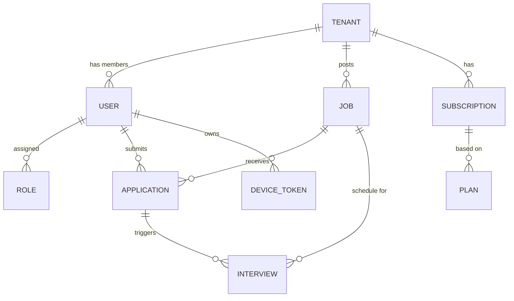

# System Patterns

## Architecture Design
The system follows a **Clean Architecture** approach combined with **Domain-Driven Design (DDD)** principles to ensure maintainability and testability at scale.

### High-Level Structure
1.  **Presentation Layer (API):** REST Controllers, DTOs, Validation.
2.  **Application Layer:** Use Cases, Service Interfaces, Orchestration.
3.  **Domain Layer (Core):** Entities, Value Objects, Domain Events, Repository Interfaces. *Zero dependencies on frameworks.*
4.  **Infrastructure Layer:** Persistence (JPA/Hibernate), External APIs (OpenAI, Payment), Messaging (Kafka).

### Multi-Tenant Strategy
We use a **Discriminator Column** strategy for maximum resource efficiency and simplified schema management.
-   **Database:** Single Shared Database.
-   **Schema:** Shared Schema.
-   **Isolation:**
    -   All business tables include a `tenant_id` column [indexed].
    -   **Hibernate Filter:** A global filter is applied at the session level to automatically enforce `tenant_id = current_tenant`.
    -   **Middleware:** A Spring Security filter extracts `tenant_id` from the JWT and sets it in the `TenantContext` (ThreadLocal).
    -   **Admin Override:** A special permission allows `ROLE_ADMIN` to bypass the filter.

### Event-Driven Architecture (EDA)
We use **Apache Kafka** to decouple services and handle high-throughput operations.

#### Core Events
| Event | Publisher | Consumers | Intent |
| :--- | :--- | :--- | :--- |
| `UserRegisteredEvent` | Identity | Notification, Wallet | Send welcome email, create wallet. |
| `JobCreatedEvent` | Recruitment | AI Matching, Search, Notification | Index job, score candidates, alert followers. |
| `ApplicationSubmittedEvent` | Recruitment | AI Scoring, Analytics | Trigger AI analysis, updatetunnel stats. |
| `InterviewScheduledEvent` | Interview | Notification, Calendar | Send invites (ICS), sync calendars. |
| `SubscriptionUpgradedEvent` | Billing | Tenant | Unlock PRO features instantly. |

## Data Model (ERD)
Key entities and their relationships.

### Key Tables
-   `tenants`: `id, approach, status, plan_id`
-   `users`: `id, tenant_id, email, password_hash, status`
-   `jobs`: `id, tenant_id, title, description, requirements_vector (for AI)`
-   `applications`: `id, tenant_id, job_id, candidate_id, status, ai_score`
-   `interviews`: `id, tenant_id, application_id, start_time, end_time, link`

## Scalability & Performance Patterns
1.  **Read-Heavy Optimization:**
    -   **Redis Cache:** Cache `Job` details, `User` profiles, and `Tenant` settings.
    -   **Elasticsearch/OpenSearch:** Offload complex job search queries and full-text resume matching.
    -   **Read Replicas:** Route `GET` requests to DB replicas; `writemaster` for modifications.

2.  **Mobile/Offline Sync:**
    -   **ETag / Last-Modified:** Check for data staleness before fetching.
    -   **Sync API:** `GET /sync?since={timestamp}` returns only changed records (soft deletes included).
    -   **Conflict Resolution:** Last-Write-Wins (LWW) with server-timestamp authority.

3.  **Security:**
    -   **Rate Limiting:** Leaky bucket algorithm (Redis-backed) per IP/User.
    -   **JWT Stateless Auth:** Short-lived Access Token (15m), Long-lived Refresh Token (7d).
